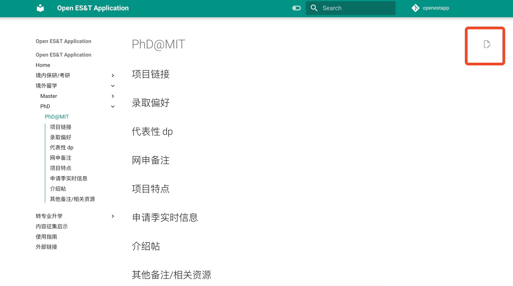

# 如何贡献

本文档是开源协同创作的，欢迎用户贡献内容

## Pull Request（推荐）

PR (Pull Request) 是基于 Git 的协同创作方式，允许用户方便地进行贡献内容，允许维护者进行审核。

下面演示通过 GitHub 网站进行无代码 PR 的最佳实践

1. 点击想要更改的页面右上角的编辑图标（铅笔形状），注意编辑选校梯度直接点击`选校梯度`页面编辑按钮

   

   

2. 初次提交点击`Fork this repository`将仓库 fork 到自己的账户下

   

3. 在窗口内使用 Markdown 语法直接进行更改，点击`Propose changes`完成更改

   

4. 点击`Create pull request`向`Open-CS-Application.github.io:master`分支发起 Pull Request

   

5. 点击`Create pull request`确认创建 Pull Request

   

6. 等待 Pull Request 审核通过后，内容会被自动编译并部署到网页，不需要用户进行额外操作。再次提交更新重复步骤 1 即可，第二次提交可以省略步骤 2

   

## 评论区

欢迎在评论区讨论，我会精选信息编入 pages
